# Smart Agriculture IoT System

Hệ thống IoT nông nghiệp thông minh với khả năng xử lý dữ liệu real-time (Hard Real-time và Soft Real-time) và edge computing.

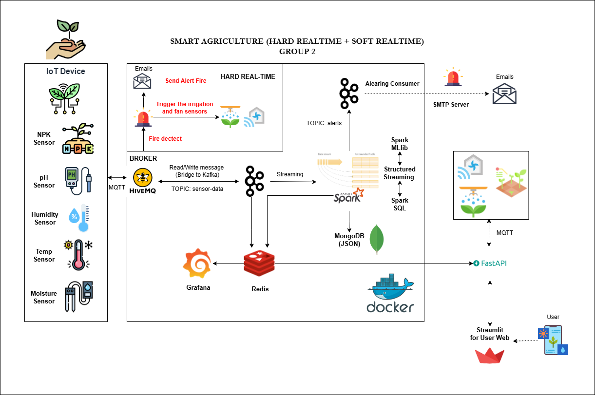

## **Tổng Quan**

Hệ thống IoT nông nghiệp thông minh được thiết kế để:
- Thu thập dữ liệu từ các cảm biến IoT (NPK, pH, độ ẩm, nhiệt độ, ...).
- Phát hiện cháy ngay lập tức kích hoạt thiết bị tưới, quạt làm mát tự động với độ trễ < 100ms. Sau đó, gửi cảnh báo qua email với độ trễ sau khi bật thiết bị < 500ms.
- Xử lý dữ liệu real-time với Spark Streaming.
- Phân tích dữ liệu và đưa ra cảnh báo qua email.
- Dự đoán thiếu hụt dinh dưỡng và bệnh cây trồng, hành động đề xuất sử dụng mô hình ML (MLP và XGBoost).
- Hiển thị thông tin trên dashboard trực quan với Grafana (Realtime-data từ Kafka và Redis) và Streamlit (ML Predictions, dữ liệu EDA, cảnh báo từ REST API).

## Cấu trúc dữ liệu mẫu

Dataset bao gồm 24 cột dữ liệu từ hệ thống IoT nông nghiệp:

### Thông Tin Vùng & Hình Ảnh

- `Zone_ID`: ID vùng canh tác (Z1, Z2, ..., Z10)
- `Image_Source_ID`: ID file ảnh từ UAV
- `Image_Type`: Loại ảnh (RGB, Multispectral)
- `UAV_Timestamp`: Timestamp chụp ảnh từ UAV

### Chỉ số ảnh
- `RGB_Damage_Score`: Điểm đánh giá thiệt hại từ ảnh RGB (0-1)

### Thông Số Đất & Môi Trường

- `N`, `P`, `K`: Nồng độ dinh dưỡng NPK
- `Moisture`: Độ ẩm đất (%)
- `pH`: Độ pH của đất
- `Temperature`: Nhiệt độ (°C)
- `Humidity`: Độ ẩm không khí (%)

### Nhãn & Khuyến Nghị

- `NDI_Label`: Nhãn Nutrient Deficiency Index (Low/Medium/High)
- `PDI_Label`: Nhãn Plant Disease Index (Low/Medium/High)
- `Semantic_Tag`: Thẻ ngữ nghĩa mô tả tình trạng
- `Action_Suggested`: Hành động được khuyến nghị

### Edge Computing Metrics

- `Energy_Consumed_mAh`: Năng lượng tiêu thụ (mAh)
- `Latency_ms`: Độ trễ xử lý (ms)
- `Current_Node`: Node hiện tại xử lý
- `Migrated_To`: Node được migrate tới
- `Migration_Required`: Yêu cầu migration (Yes/No)
- `Migration_Timestamp`: Timestamp migration

### Dữ liệu giả lập cảm biến IoT
- `Sensor_Timestamp`: Timestamp dữ liệu cảm biến
- `Sensor_ID`: ID cảm biến
- `N`, `P`, `K`: Nồng độ dinh dưỡng NPK
- `Moisture`: Độ ẩm đất (%)
- `pH`: Độ pH của đất
- `Temperature`: Nhiệt độ (°C)
- `Humidity`: Độ ẩm không khí (%)
- `RGB_Damage_Score`: Điểm đánh giá thiệt hại từ ảnh RGB (0-1)

> Đây sẽ là những dữ liệu được giả lập thành các loại cảm biến và gửi từ IoT simulator qua MQTT broker. 

## Cài Đặt

1. **Clone repository**

```bash
git clone https://github.com/TherNgyn/SMART_AGRICULTURE_IoT_Group_3.git
cd iot_smart-agri
```

2. **Cài đặt dependencies**

```bash
pip install -r requirements.txt
```

3. **Cấu hình environment**

```bash
cp .env.example .env
# Chỉnh sửa .env với thông tin MQTT broker của bạn
```

4. **Chia dữ liệu**

```bash
python scripts/split_data.py
```

## Sử Dụng

### 1. Phân tích dữ liệu

```bash
python scripts/analyze_data.py
```

### 2. Test MQTT connection

```bash
python scripts/test_mqtt.py
```

### 3. Test publish message

```bash
python scripts/test_publish.py
```

### 4. Chạy IoT simulator

```bash
python scripts/iot_simulator.py
```

### 5. Chạy hệ thống complete với Docker

> Hệ thống chạy trên Docker với tất cả các services (MQTT Broker, Kafka, Spark, API, Dashboard,...).

> Spark sẽ bao gồm Spark master và Spark worker. Các spark job sẽ chạy trên Spark cluster này.

```bash
docker-compose up --build
```
#### 5.1. Chạy theo cách 1:
Sau khi build xong, mở cmd mới và chạy lệnh:
```bash
docker-compose up
```

> Cách này sẽ chạy 1 spark job theo thứ tự, và các job khác sẽ chờ cho đến khi job trước hoàn thành (WAITTING). Do chưa cấu hình thêm worker nodes động cho spark cluster.

#### 5.2. Chạy theo cách 2:
Cho phép chạy nhiều spark job song song trên cùng 1 spark cluster.
Sau khi build xong, mở cmd mới và chạy lệnh:
```bash
docker-compose up --scale spark-worker=4
```
> Có thể mở rộng số lượng worker nodes bằng cách thay đổi giá trị `4` thành số mong muốn. Ở project này, có 4 job chính: EDA theo window, Machine Learning dự đoán nhãn PDI_Label, NDI_Label, Action_Suggested, lưu data vào MongoDB, và đẩy data realtime vào Redis. Nên có thể chạy tối đa 4 worker nodes để xử lý song song (mỗi job chạy với 12 cores).

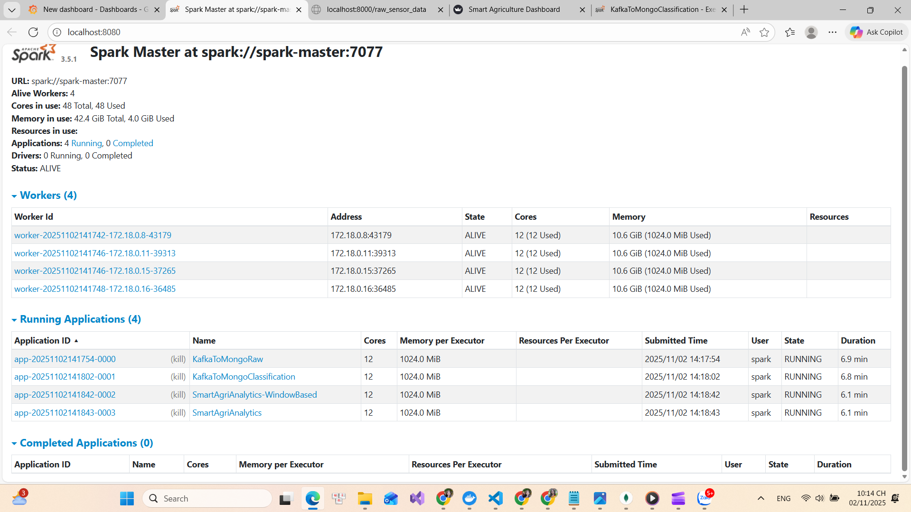

> Truy cập Spark UI tại: `http://localhost:8080` để theo dõi các job đang chạy. Có thể Kill các job nếu cần.

## Kiến Trúc Hệ Thống

```
IoT Sensors → MQTT Broker → Kafka → Data Processing
     ↓
Edge Computing Nodes ← Migration Logic
     ↓
Real-time Analytics & Dashboard
```


### Components

1. **IoT Simulator**: Mô phỏng sensors gửi dữ liệu qua MQTT
2. **MQTT-Kafka Bridge**: Chuyển dữ liệu từ MQTT sang Kafka
3. **Edge Computing**: Xử lý dữ liệu phân tán với migration logic
4. **Data Processing**: Phân tích và xử lý dữ liệu real-time

## Dữ Liệu Mẫu

Dataset chứa 60,000+ records với:

- 10 vùng canh tác (Z1-Z10)
- Dữ liệu từ nhiều loại sensor
- Hình ảnh multispectral và RGB
- Metrics edge computing
- Khuyến nghị hành động

## Dữ liệu giả lập
Dataset chứa 15000 records giả lập dữ liệu cảm biến IoT với các trường như đã mô tả ở phần "Cấu trúc dữ liệu mẫu".

## Dữ liệu train mô hình
Dataset chứa 45000 records dùng để train mô hình ML (MLP và XGBoost) dự đoán nhãn PDI_Label, NDI_Label, Action_Suggested.
## File Structure

```
iot_smart-agri/
├── api/                      # Backend API (FastAPI)
│   ├── Dockerfile            # Dockerfile cho API
│   └── ...                   # Các file liên quan đến API
├── bridge/                   # MQTT-Kafka Bridge khiển
│   ├── Dockerfile            # Dockerfile cho bridge
│   └── ...                   # Các file liên quan đến bridge
├── consumer/                 # Kafka Consumer cho cảnh báo
│   ├── consumer_canh_bao.py  # Xử lý cảnh báo từ Kafka
│   ├── Dockerfile            # Dockerfile cho consumer
│   └── ...                   # Các file liên quan đến consumer
├── dashboard/                # Streamlit Dashboard
│   ├── Dockerfile            # Dockerfile cho dashboard
│   └── ...                   # Các file liên quan đến dashboard
├── data/                     # Dữ liệu gốc và phân tách
│   ├── data.csv              # Dataset gốc
│   ├── train_45000.csv       # Dữ liệu training
│   └── stream_15000.csv      # Dữ liệu streaming
├── grafana/                  # Grafana Dashboard
│   ├── Dockerfile            # Dockerfile cho Grafana
│   └── ...                   # Các file liên quan đến Grafana
├── models/                   # Mô hình Machine Learning
│   └── ...                   # Các file mô hình ML
├── mongo_data/               # Dữ liệu MongoDB
│   └── ...                   # Thư mục lưu trữ dữ liệu MongoDB
├── scripts/                  # Các script chính
│   ├── iot_simulator.py      # Mô phỏng dữ liệu IoT
│   ├── mqtt_kafka_bridge.py  # MQTT-Kafka Bridge
│   ├── split_data.py         # Phân tách dữ liệu
│   ├── test_mqtt.py          # Kiểm tra kết nối MQTT
│   ├── test_publish.py       # Kiểm tra publish dữ liệu
│   ├── spark_alert_dashboard.py # Xử lý cảnh báo với Spark
│   ├── spark_eda_windowing.py   # EDA với Spark Streaming
│   ├── Spark_App_Extract_datas.py # Trích xuất dữ liệu với Spark
│   ├── spark_app_prediction.py # Dự đoán với mô hình ML
│   └── kafka_grafana.py      # Đẩy dữ liệu từ Kafka sang Grafana
│   ├── mqtt_kafka_bridge.py  # Chuyển dữ liệu từ MQTT sang Kafka
│   ├── mqtt_alert_consumer.py # Consumer MQTT cảnh báo
│   ├── actuator_simulator.py # Mô phỏng actuator (thiết bị điều khiển giả lập phun nước, quạt,...)
├── simulator/                # IoT Simulator
│   ├── Dockerfile            # Dockerfile cho simulator
│   └── ...                   # Các file liên quan đến simulator
├── spark/                    # Spark Cluster
│   ├── Dockerfile            # Dockerfile cho Spark
│   ├── Dockerfile.model      # Dockerfile cho Spark ML
│   └── ...                   # Các file liên quan đến Spark
├── docker-compose.yml        # Docker Compose file
├── requirements.txt          # Python dependencies
├── README.md                 # Tài liệu hướng dẫn
├── .env                      # File cấu hình môi trường
├── image.png                 # Sơ đồ kiến trúc hệ thống
└── image-1.png               # Hình ảnh minh họa dashboard

```

## Cấu hình

Hệ thống sử dụng file `.env` để quản lý tất cả các biến môi trường.

1.  Đảm bảo bạn có file `.env` ở thư mục gốc của dự án.
2.  Mở file `.env` và **cấu hình các biến sau** để nhận email cảnh báo:

    ```env
    # ------------------------------------------------
    # Cấu hình Gửi Email (cho alert-consumer)
    # ------------------------------------------------
    SMTP_SERVER=smtp.gmail.com
    SMTP_PORT=587
    EMAIL_USER=your_email@gmail.com
    EMAIL_PASS=your_google_app_password # QUAN TRỌNG: Phải là Mật khẩu ứng dụng 16 ký tự
    EMAIL_TO=recipient_email@example.com
    ```

3.  **Lấy Mật khẩu ứng dụng (EMAIL_PASS):**
    * Bạn **không thể** dùng mật khẩu Gmail thông thường.
    * Bật "Xác minh 2 bước" cho tài khoản Google của bạn.
    * Vào [Bảo mật Tài khoản Google](https://myaccount.google.com/security) ➔ **Mật khẩu ứng dụng** ➔ tạo một mật khẩu mới cho "Ứng dụng khác" và dán 16 ký tự đó vào file `.env`.

## Kiểm tra chức năng (Checklist)

Sau khi chạy `docker-compose build`, `docker-compose up --scale spark-worker=4 ` và chờ khoảng 1 phút, hãy thực hiện các bước sau:

1.  **Kiểm tra Trạng thái Container:**
    * Mở một Terminal mới và chạy: `docker ps`
    * **Kết quả mong đợi:** Thấy **23 container** và tất cả đều có **STATUS** là `Up` hoặc `running (healthy)`.

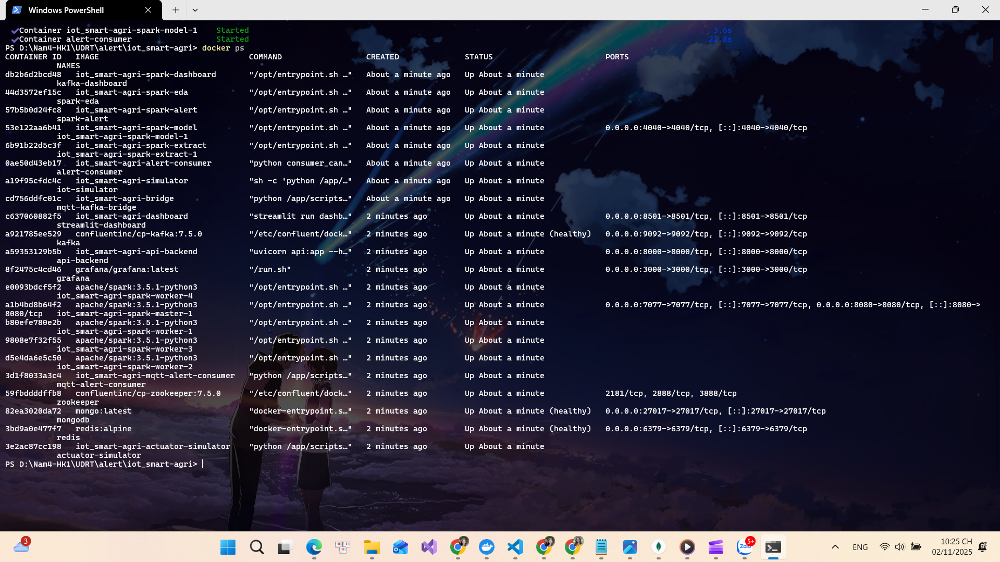

2.  **Kiểm tra Log Spark**:
    * Bao gồm 4 job chính:
        * EDA với windowing (`spark-eda`)
        * Dự đoán nhãn PDI_Label, NDI_Label, Action_Suggested (`spark-model`)
        * Lưu dữ liệu vào MongoDB (`spark-extract`)
        * Đẩy dữ liệu real-time vào Redis, dashboard trên Streamlit (`spark-alert`)
    * Chạy lệnh: `docker-compose logs <container_name>`
        * Ví dụ: `docker-compose logs spark-alert`
    * **Kết quả mong đợi:**:
        * EDA với windowing (`spark-eda`)
        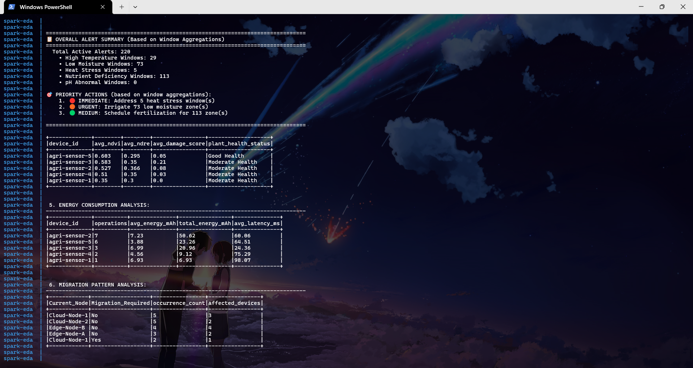
        * Dự đoán nhãn PDI_Label, NDI_Label, Action_Suggested (`spark-model`): 
        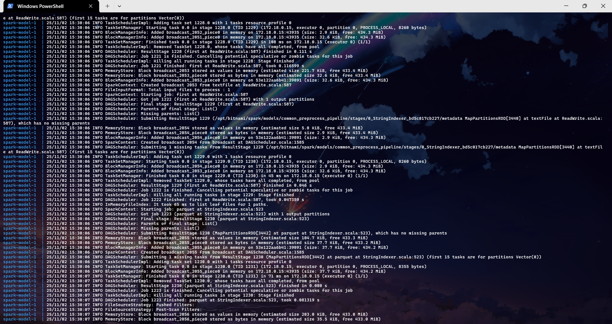
        * Lưu dữ liệu vào MongoDB (`spark-extract`):
        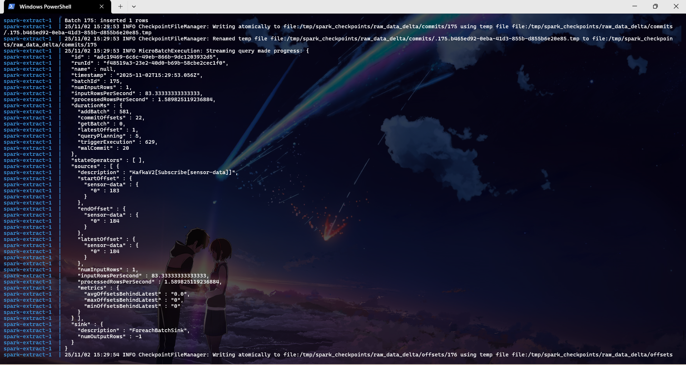
        * Đẩy dữ liệu real-time vào Redis, dashboard trên Streamlit (`spark-alert`):
        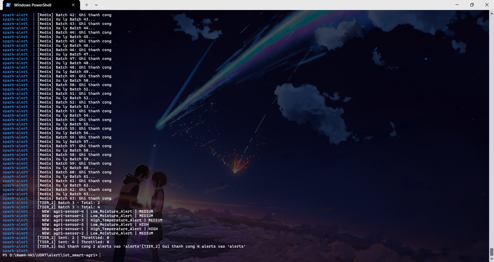
3. **Kiểm tra data lưu trong MongoDB:**
    * Mở MongoDB Compass và kết nối đến `mongodb://mongo:27017`
    * Chọn database `Realtime-Project` và collection `sensor_raw`, `sensor_predicted`.
    * **Kết quả mong đợi:** Thấy dữ liệu được lưu trữ với các trường như trong cấu trúc dữ liệu mẫu.
    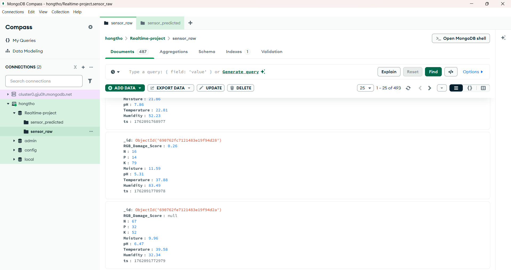
    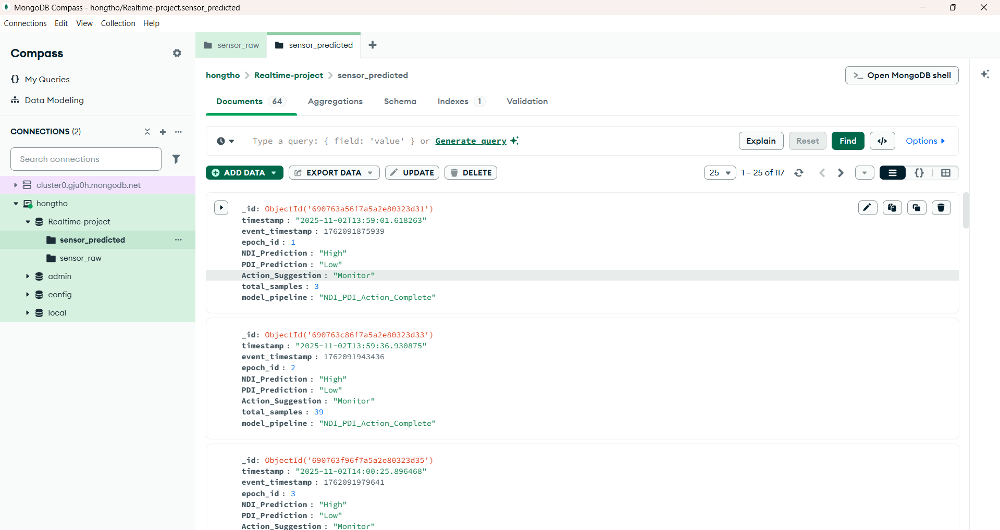
4.  **Kiểm tra Log API (`api-backend`):**
    * Chạy lệnh: `docker-compose logs api-backend`
    * **Kết quả mong đợi:**
        * `INFO: API ket noi Redis thanh cong.`
        * `INFO: Application startup complete.`
        * Sau đó là một loạt các dòng `GET /metrics/realtime HTTP/1.1" 200 OK` và `GET /charts/... HTTP/1.1" 200 OK`.
    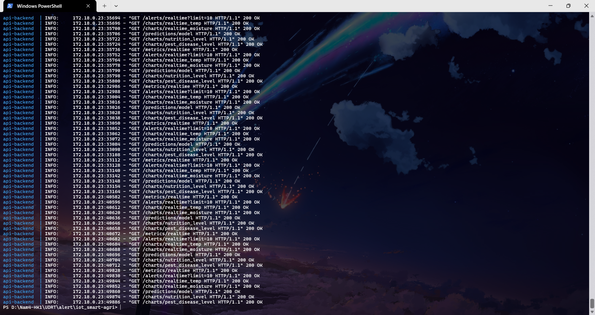
    * Có thể kiểm tra bằng cách truy cập API trực tiếp:
        * Mở trình duyệt và truy cập: `http://localhost:8000/...`
        * ... là các endpoint như:
            * `metrics/realtime`
            * `charts/realtime_temp`
            * `charts/realtime_moisture`
            * `charts/nutrition_level`
            * `charts/pest_disease_level`
            * `charts/action_suggestion`
            * `predictions/model`
            * `alerts/realtime`
            * `raw_sensor_data`

        * **Kết quả mong đợi:** Hiển thị dữ liệu JSON với các trường như trong cấu trúc dữ liệu mẫu.
        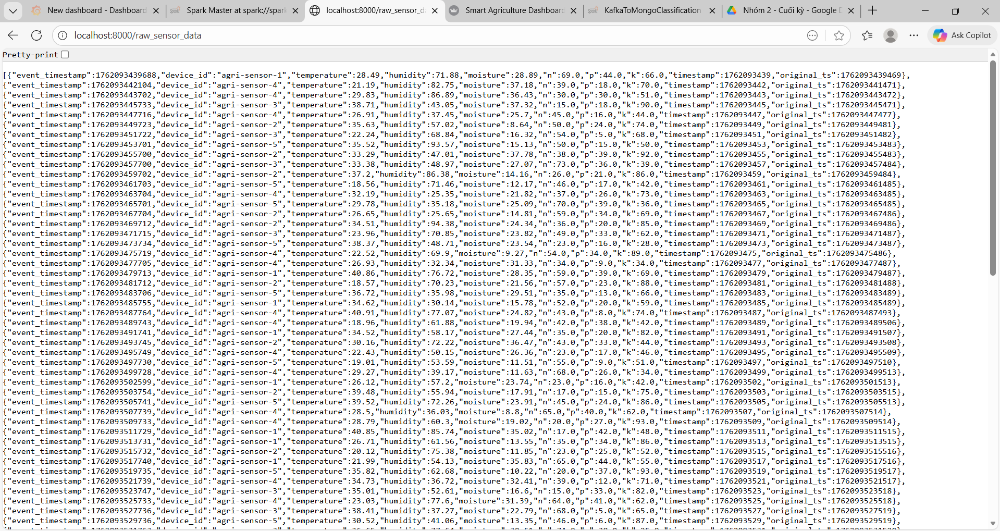
5.  **Kiểm tra Dashboard:**
    * **Grafana Dashboard:**
        * Mở trình duyệt và truy cập: `http://localhost:3000`
        * Đăng nhập với username: `admin`, password: `admin` (hoặc mật khẩu bạn đã đổi).
        * **Kết quả mong đợi:**
            * Dashboard hiển thị các biểu đồ real-time (Nhiệt độ, Độ ẩm, NPK,...) trực tiếp từ Kafka.
        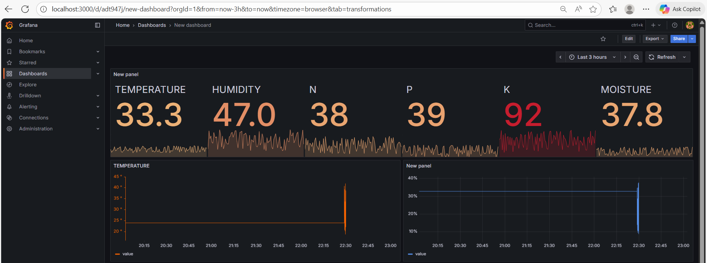
    * **Streamlit Dashboard:**
        * Mở trình duyệt và truy cập: `http://localhost:8501`
        * **Kết quả mong đợi:**
            * Các thẻ chỉ số (Nhiệt độ TB, Độ ẩm TB,...) hiển thị số liệu.
            * Các biểu đồ real-time (Nhiệt độ, Độ ẩm,...) bắt đầu vẽ và cập nhật liên tục.
        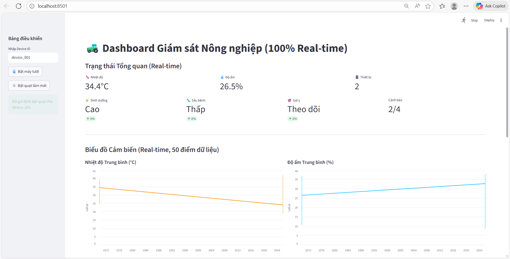
        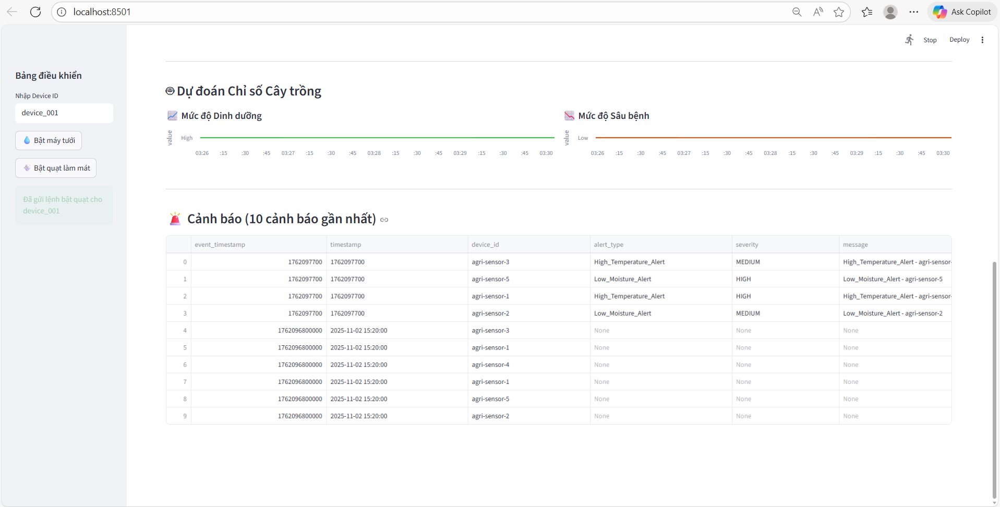
6.  **Kiểm tra Cảnh báo Email:**
    * Chờ `iot-simulator` gửi dữ liệu bất thường (ví dụ: nhiệt độ > 35°C).
    * Quan sát log của `alert-consumer`: `docker-compose logs alert-consumer`
    * **Kết quả mong đợi:**
        * `Nhan du lieu canh bao: ...`
        * `Da gui email canh bao: ...`
    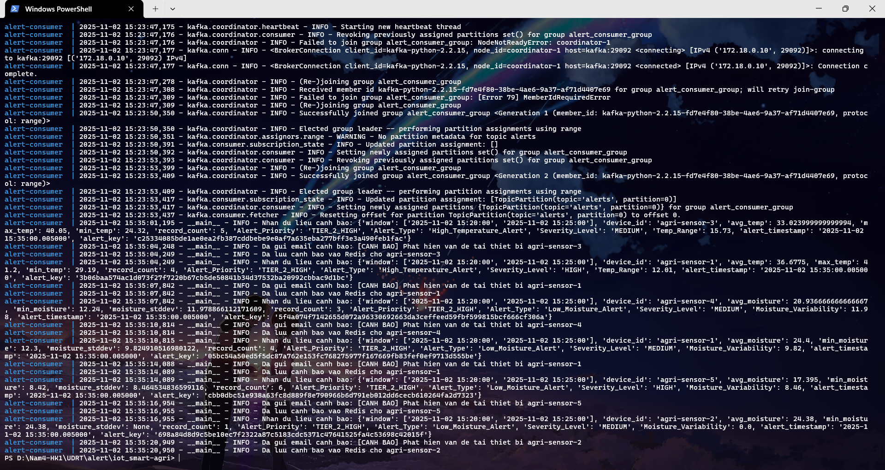
    * Kiểm tra hộp thư `EMAIL_TO` của bạn.
    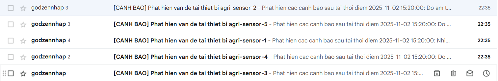
7. **Cảnh báo cháy qua MQTT và kiểm tra actuator giả lập:**
    * Khi `iot-simulator` gửi dữ liệu nhiệt độ > 50°C, hệ thống sẽ kích hoạt cảnh báo cháy.
    * Quan sát log của `actuator-simulator`: `docker-compose logs actuator-simulator`
    * **Kết quả mong đợi:**
    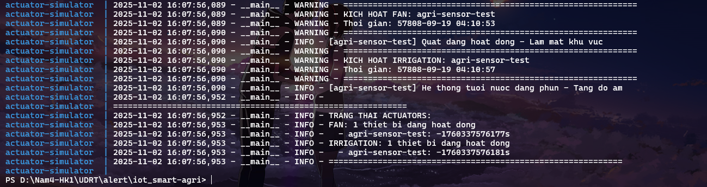
    * Kiểm tra hộp thư `EMAIL_TO` của bạn để nhận cảnh báo cháy.
    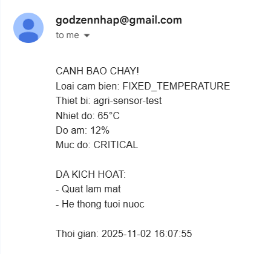
    * Có thể gửi thử dữ liệu nhiệt độ cao từ `test_publish.py` để kích hoạt cảnh báo cháy nhanh hơn (cấu hình Temperature > 60°C và Humidity < 25% - tham khảo tài liệu mức cháy thường ở mức này).
    * Chạy lệnh: `python scripts/test_publish.py` để gửi dữ liệu thử.
    * Ngay lập tức sẽ có logs bật hệ thống tưới nước, quạt làm mát và email được gửi đi (độ trễ <100ms để bật thiết bị, <500ms để gửi email).
8. **Bật thiết bị tưới nước, quạt làm mát tự động trên Streamlit:**
    * Khi click vào nút **Bật máy tưới nước, quạt làm mát** trên dashboard Streamlit, hệ thống sẽ gửi lệnh bật thiết bị qua MQTT.
    * Quan sát log của `actuator-simulator`: `docker-compose logs actuator-simulator`
    * **Kết quả mong đợi:**

    * 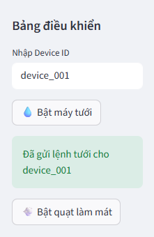

    * 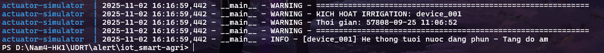
---

## Tài liệu Tham Khảo
[1] S. Ryza, U. Laserson, S. Owen, and J. Wills, “Advanced Analytics with Spark” Sebastopol, CA: O’Reilly Media, 2015.

[2] A. G. Psaltis, “Streaming Data: Understanding the Real-Time Pipeline”. Shelter Island, NY: Manning Publications Co., 2017.

[3] B. Patil, “IoT and Big Data Integration for Real-Time Agricultural Monitoring,” Journal of Advanced Zoology, vol. 44, no. 2, pp. 3058–3070, Oct. 2023. [Online]. Available: https://www.researchgate.net/publication/375073844

[4] Kaarthiik Thota and Anshu Vajpayee, “Build a sensor network using AWS IoT Core and Amazon DocumentDB, Amazon Web Services”. (2023, October 24). Amazon Web Services.
Available:https://aws.amazon.com/blogs/database/build-a-sensor-network-using-aws-iot-core-and-amazon-documentdb/

